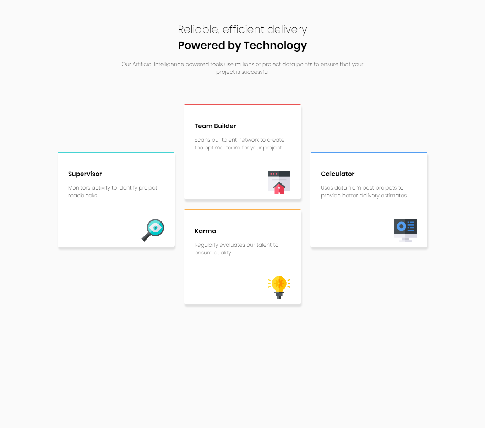
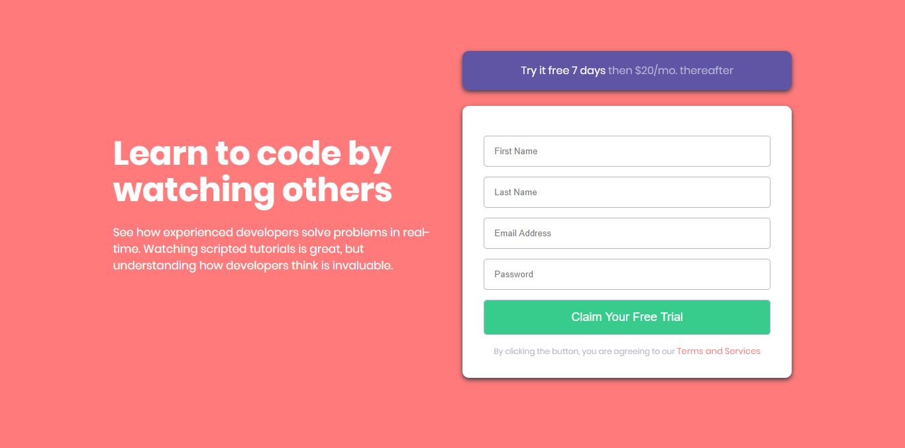
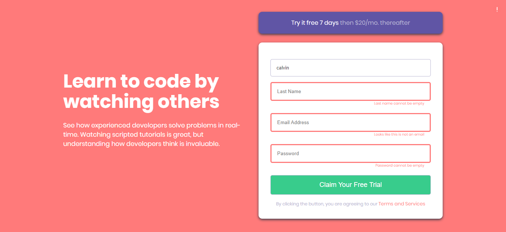
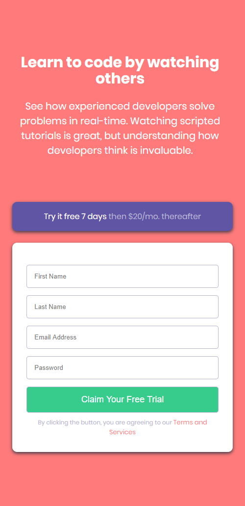
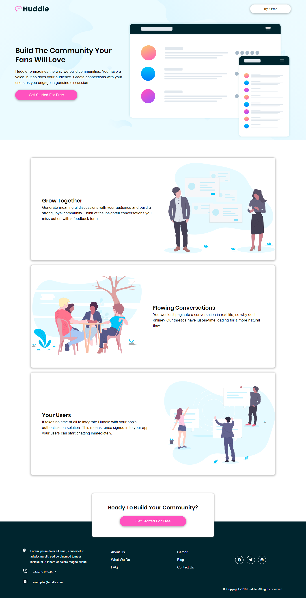
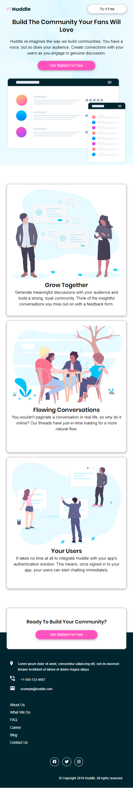
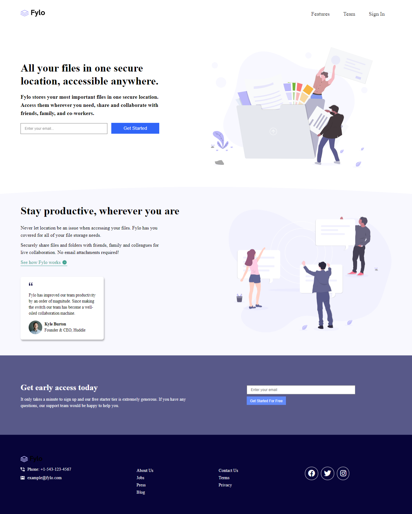
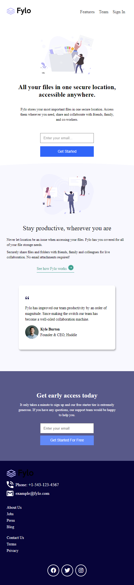

# Collection of Frontend Mentor Solutions

A collection of my submission for frontend mentor challenges

1. Four Card Features Section

   **Desktop View**

   

2. Intro Component With SignUp Form

   **Desktop View**

   

   **Active State**

   

   **Mobile View**

   

3. Huddle Landing Page Intro Section

**Desktop View**

**Mobile View**

4. Complete Huddle Landing Page

**Desktop View**

**Mobile View**

4. Complete Huddle Landing Page 2

**Desktop View**

**Mobile View**

